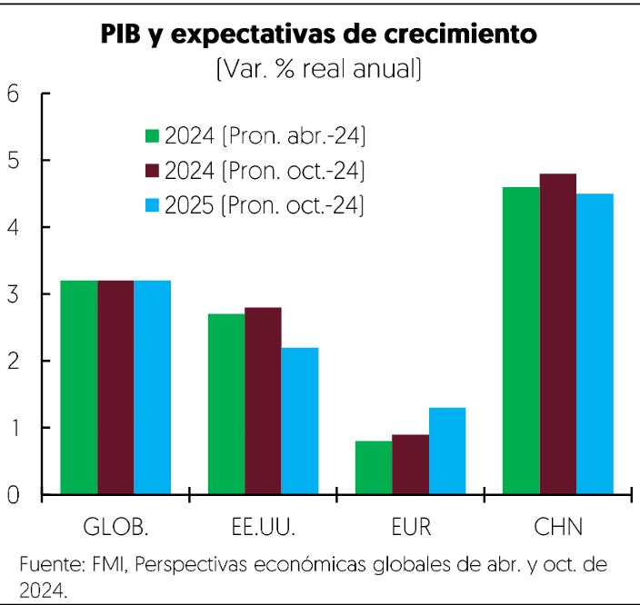
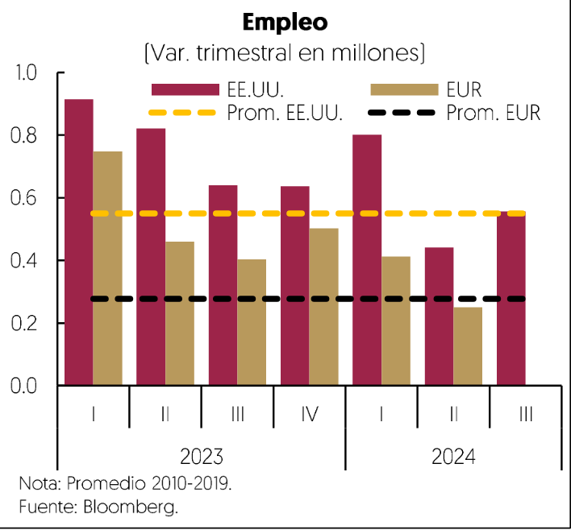

[⬅️ Anterior: 9](./9.md)[➡️ Siguiente: 11](./11.md)

# Página 10

la alta particioacio6n de migrantes, que representd 19% del total. Los salarios reales por hora crecieron de 0.9%
en diciembre a 1.3% en septiembre debido a la menor tasa de inflacién, mejorando el poder adquisitivo de los
hogares.

En la zona euro, la tasa de desempleo se mantuvo en minimos histdricos del 6.3% en septiembre. La creacion
de empleo disminuyd de un promedio de 167.4 mil en el cuarto trimestre de 2023 a 83.4 mil generados en el
segundo trimestre de 2024. Por su parte, los salarios reales por hora crecieron de 0.9% a 1.9% durante el mismo
periodo, debido a su vez a la menor inflacién.

Inflacion
La inflacidn global disminuyé en 2024 en economias avanzadas y emergentes, impulsada por la caida en los
precios de mercancias y materias primas. En EE.UU., la inflacidn general anual, medida por el indice de gasto

en consumo personal [PCE], disminuyé de 2.7% en diciembre pasado a 2.1% en septiembre, mientras que la
inflacién subyacente bajé de 3.1% a 2.7%. La renta de vivienda explicd gran parte de la persistencia, con una
contribucién de 0.8 pp al crecimiento general en septiembre, mientras que el rubro de bienes rest 0.4 pp.

En la zona euro, la inflacidn anual crecio 2.0% en octubre, en linea con el objetivo de 2.0% del Banco Central
Europeo [BCE]. Esta disminucién se debid principalmente a la disminucién en precios de energéticos y del
componente subyacente, que bajd de 3.4% en diciembre a 2.7% en octubre, aunque los precios siguieron
presionados por la persistencia del sector servicios. En contraste, la debilidad del mercado interno en China se
reflejd en bajos niveles de inflacién, con una tasa anual en promedio de 0.3% a septiembre, impulsada por
menores precios de servicios y transporte.

Los precios de las materias primas presentaron volatilidad, pero con una tendencia a la baja respecto al afho
previo, lo que contribuy6 a reducir las presiones inflacionarias. Al 31 de octubre, los precios del petrdleo Brent,
WTI y la Mezcla mexicana promediaron 82.0, 77.0 y 71.8 ddlares por barril, respectivamente, lo que representd
variaciones de -1.3, -1.5 y 0.7% en comparacién con el mismo periodo de 2023. Lo anterior se debid al efecto
de la debilidad econdmica en China, la desaceleracidn del sector manufacturero y el aumento de la
produccidn de petrdleo en paises como EE.UU., Brasil y Guyana. Ello contrarrestd el efecto de las tensiones en
Medio Oriente y los recortes de produccién de petrdleo implementados por la Organizacién de Paises
Productores de Petrdleo y sus aliados [OPEP+].

[⬅️ Anterior: 9](./9.md)[➡️ Siguiente: 11](./11.md)