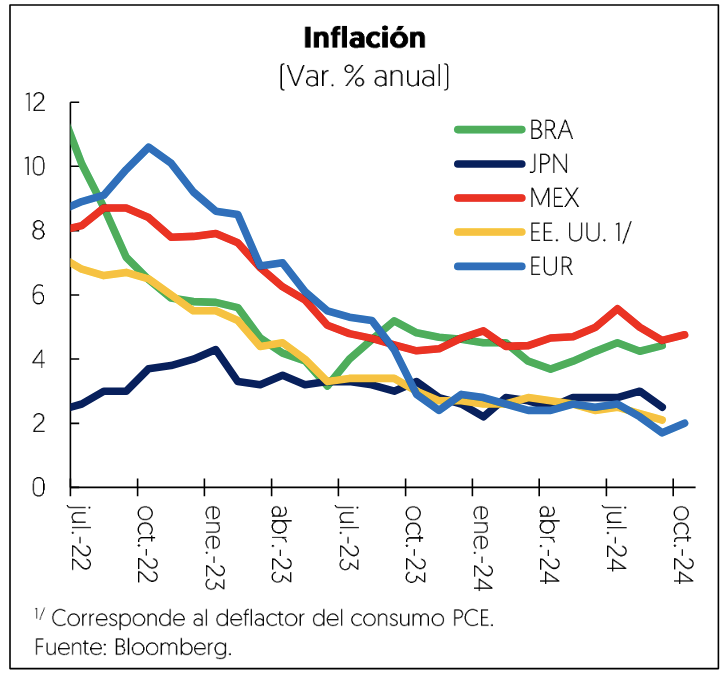
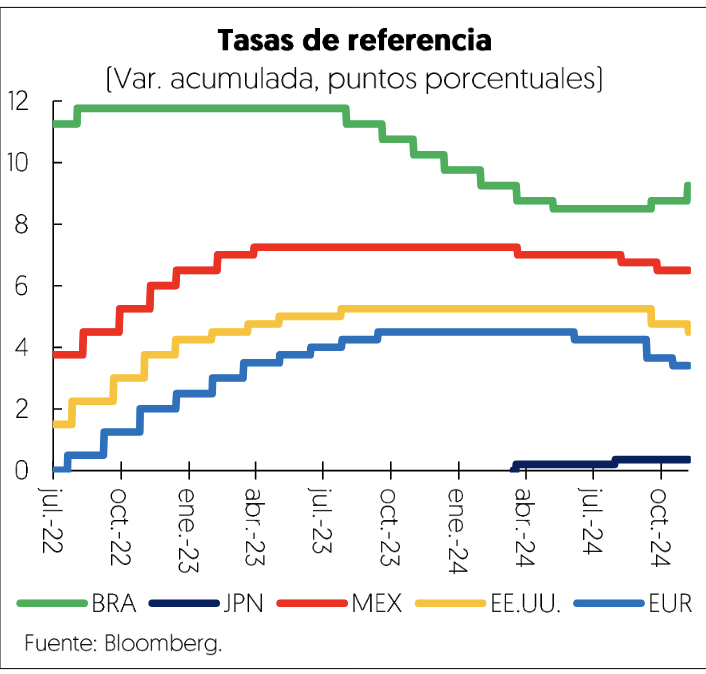

[⬅️ Anterior: 10](./10.md)[➡️ Siguiente: 12](./12.md)

# Página 11

Adicionalmente, se observ una caida anual en el promedio de enero a octubre de 3.6% del indice de precios
de los alimentos de la Organizacién de las Naciones Unidas para la Alimentacion y la Agricultura (FAO). En el
mismo periodo, destacé la caida en los precios de los cereales, en 14.2%; particularmente el maiz que se redujo
275% debido al incremento en las cosechas de Argentina y Brasil. Los precios del azuicar también se redujeron
tras el fin del fenédmeno EI niño en mayo y por la cosecha favorable en Brasil, principal exportador.

Politica monetaria

En 2024, la mayoria de las economias avanzadas comenzo a reducir sus tasas de referencia a medida que se
moderaron las presiones inflacionarias y laborales. Un caso que contrast6 fue Japon, que puso fin a su politica

de tasas de interés negativas y elevd su tasa de referencia en dos ocasiones, en marzo y julio, como medida
para contener la inflacion.

Por su parte, en las ultimas dos reuniones del 18 de septiembre y 7 de noviembre, el Comité de Mercado
Abierto en EE.UU. recortd su tasa de politica monetaria en 50 y 25 pb, respectivamente, situandola en 4.50%-
475%. Mientras tanto, mantuvo la reduccién de su hoja de balance, que al 6 de noviembre alcanzd 7.0 mil
millones de délares, 9.3% menos que el cierre de 202%, tras bajar el ritmo de reduccién de activos de 95 a 65
mil millones de ddlares en mayo. Por su parte, el BCE realizd, en junio, septiembre y octubre, tres recortes de
25 pb cada uno en su tasa de depdsitos, por lo que la tasa se ubicd en 3.25%, mientras que la tasa de
refinanciamiento se situd en 3.40% y la de crédito marginal en 3.65%.

En la mayoria de las economias emergentes, las tasas de interés mantuvieron su tendencia decreciente,
impulsadas por la disminucién de las presiones inflacionarias y, en algunos casos, para estimular el crecimiento
econdmico. Por el contrario, Brasil revirtid el relajamiento monetario, con un incremento de su tasa de referencia

en septiembre y noviembre de 25 pb debido al aumento de la inflacién y al mayor dinamismo al previsto en
su economia.

Mercados financieros

Las condiciones financieras se mantuvieron restrictivas durante 2024, aunque mejoraron ante las expectativas
de mayores recortes de tasas por parte de las economias avanzadas. También se registraron episodios de alta
volatilidad, como en la primera semana de agosto, debido a una menor creacién de empleo al anticipado en
EE.UU. y el aumento de la tasa de referencia por parte del Banco Central de Japdn, lo que provocé pérdidas

[⬅️ Anterior: 10](./10.md)[➡️ Siguiente: 12](./12.md)