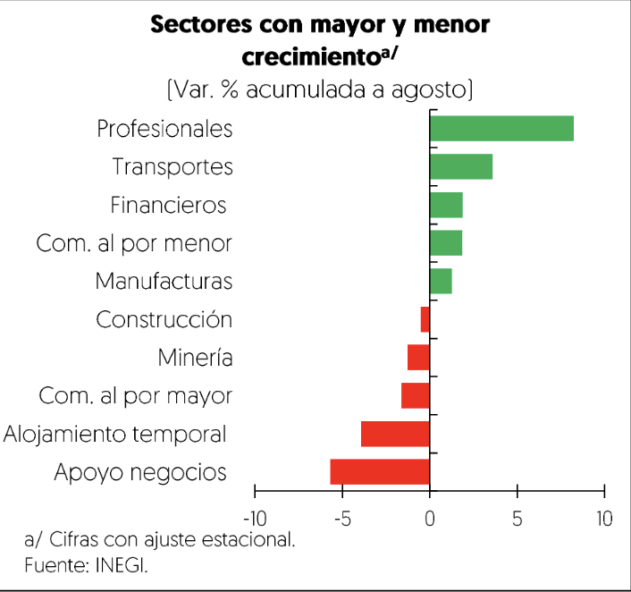

[⬅️ Anterior: 12](./12.md)[➡️ Siguiente: 14](./14.md)

# Página 13

El sector externo también contribuyé al crecimiento de la actividad econdémica por medio del flujo de remesas,
la entrada de viajeros internacionales al pais y el aumento del volumen de las exportaciones manufactureras
automotrices, esto a pesar de que el tipo de cambio real se mantiene fuerte en relacién con el periodo pre-
pandemia. Asimismo, se intensificd la confianza de las empresas globales en México a través del mayor flujo
de IED, en un contexto donde los flujos globales llevan una tendencia a la baja. En particular, el sector
manufacturero y el de servicios financieros fueron los principales receptores de esta nueva inversion.

2.2.1 Evolucién observada durante 2024

Comportamiento sectorial

En el tercer trimestre las actividades primarias aumentaron 4.6% luego de que, en la primera mitad de 2024, la
agricultura se contrajera 3.2% respecto al semestre anterior, con cifras ajustadas por estacionalidad. Esta mejora
en el crecimiento se dio por menores niveles de sequia en el pais, las cuales habian perjudicado a cultivos
clave como el maiz, el trigo y el jitomate. Por su parte, la ganaderia y el aprovechamiento forestal, la pesca y la
caza registraron incrementos semestrales de 0.8%.

Las actividades secundarias aumentaron 0.8% al tercer trimestre por el desempefio del sector de energia
eléctrica y la construccién, en donde destacé el alza de la edificacién y la mayor produccién en centrales
hidraulicas. Por otro lado, las manufacturas y la mineria retrocedieron por la finalizaci6n de algunos proyectos
de infraestructura publica que se reflej6 en la disminucidn de los servicios relacionados a la mineria y, por el
retroceso de las manufacturas ligadas al mercado doméstico.

En el caso de las actividades terciarias, al tercer trimestre del afo éstas registraron un crecimiento de 1.7% en el
acumulado del afo, impulsadas por la continua demanda de servicios logisticos por el comercio electrénico y
el desarrollo de la proveeduria nacional. Adicionalmente, otros servicios se beneficiaron del crecimiento de la
demanda en un contexto de crecimiento de los salarios, creacidn de empleo y bajo desempleo.

Demanda agregada

En el primer semestre de 2024, el consumo privado crecid 3.5% promedio anual, con lo que hild cuatro afios
de alzas continuas por arriba del promedio de 2011 a 2019 (2.4% anual]. En su interior, los bienes duraderos y
semi-duraderos registraron las mayores alzas de 16.7 y 7.0%, respectivamente. Los bienes no duraderos

[⬅️ Anterior: 12](./12.md)[➡️ Siguiente: 14](./14.md)