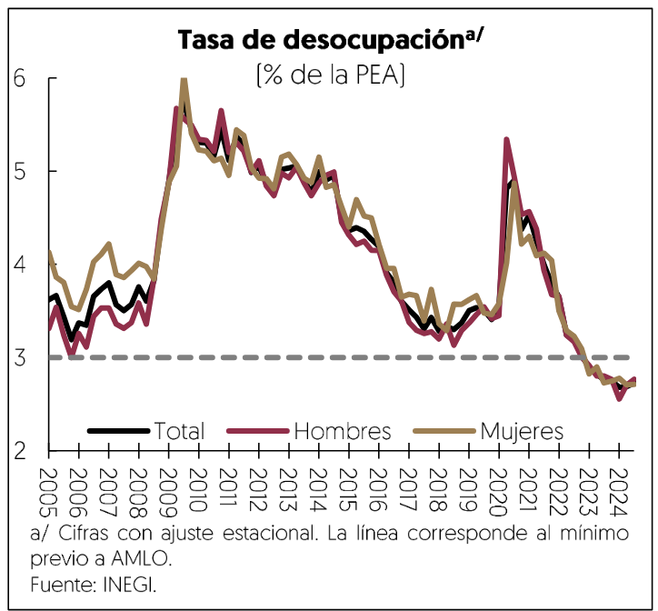
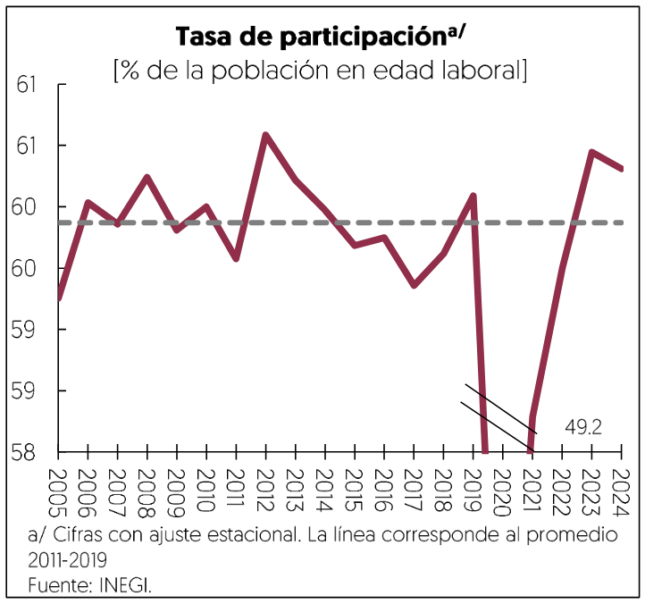

[⬅️ Anterior: 13](./13.md)[➡️ Siguiente: 15](./15.md)

# Página 14

aumentaron 1.3%, con lo que hilaron tres semestres de alzas continuas. El crecimiento de los servicios se moder6

a un nivel promedio de 1.7% anual, luego de tres aflos de dinamismo impulsado por la alta demanda tras la
pandemia del COVID-19.

La inversion fija bruta crecid 7.7% promedio anual durante los primeros seis meses de 2024, lo cual fue cinco
veces superior al promedio de crecimiento de 2011 a 2019. Lo anterior se explicd por los aumentos de todos
sus Componentes. La inversidn en maquinaria y equipo se incrementdé 4.5% promedio anual en linea con los
indicadores de confianza empresarial y el momento adecuado para invertir. Asimismo, el crecimiento de la
construccion no residencial fue de 15.3% debido a la demanda para adecuacién de espacios industriales y
centros de almacenamiento. Por otra parte, la construccién residencial crecidé 5.4% promedio anual por el alza
del rubro residencial, luego de dos afios con los altos costos de materiales de construccién.

Mercado laboral

El desempefo del mercado laboral durante 2024 ha reflejado que la economia mexicana mantiene su
dinamismo en la creacidn de empleos y dara soporte al consumo privado. Los datos de la Encuesta Nacional
de Ocupacién y Empleo [ENOE] mostraron que, en promedio, entre enero y septiembre de 2024, la poblacién
ocupada se incrementd anualmente en 763 mil personas. Por sectores, los mayores aumentos anuales se
registraron en la construccidn (190 mil], servicios sociales (166 mil], servicios de transporte [156 mil], restaurantes
y servicios de alojamiento [140 mil], y manufacturas (129 mil]. La tasa de desocupacién promedié 2.7% entre
enero y septiembre, el menor nivel que se haya registrado desde que inicid la ENOE en 2005. Lo anterior se
explicd, principalmente, por la reduccidn de la poblacidn desocupada de mas de 25 afios, asi como aquellos
con educacién hasta secundaria y con una duracidn de solo un mes de desempleo.

La tasa de participacion laboral promedidé 60.2% durante el periodo de enero a septiembre, ubicandose como
la tercera mas alta que se haya registrado desde que inicid la ENOE en 2005. No obstante, lo anterior no
presiono a la tasa de informalidad, la cual promedidé en 54.3% en el mismo periodo, también en el nivel mas
bajo que se haya registrado dese que inicié la ENOE sin considerar la pandemia.

Por otra parte, las cifras de los trabajadores afiliados al IMSS mostraron la creacién de 594 mil 556 nuevos
puestos al cierre de octubre, de los cuales 574 mil 974 fueron permanentes, mientras que los eventuales

[⬅️ Anterior: 13](./13.md)[➡️ Siguiente: 15](./15.md)