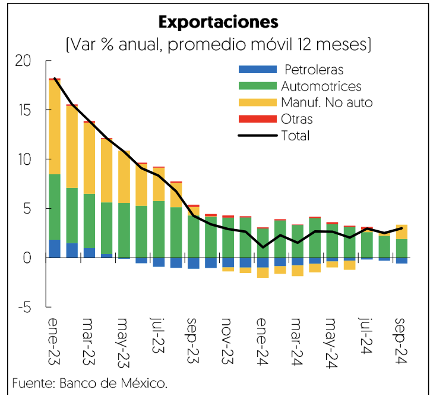
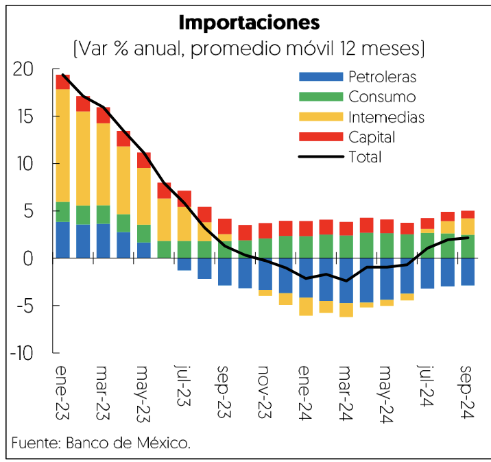

[⬅️ Anterior: 14](./14.md)[➡️ Siguiente: 16](./16.md)

# Página 15

aumentaron en 19 mil 582. Por sectores, los mayores crecimientos se dieron en el comercio [142 mil], los
servicios para empresas y hogares [127 mil] y las manufacturas [125 mil].

Los salarios reales continuaron aumentando, principalmente, por las revisiones al salario minimo y la mayor
demanda de trabajo respecto a 2023. En particular, los salarios reales del IMSS se incrementaron 4.7% entre
enero y octubre, siendo el tercer aumento mas alto desde que se tiene registro; mientras que el salario
promedio real de la ENOE crecidé 6.1% al mes de septiembre, con lo cual la masa salarial registr6 un aumento
real de 6.8% en el mismo periodo. Finalmente, los salarios contractuales de jurisdiccién federal registraron un
alza de 3.2% real anual a octubre, lo que beneficid a un milldn 476 mil personas trabajadoras.

Sector externo

Entre enero y septiembre de 2024, la balanza comercial presentd un déficit de 11 mil millones de délares,
ligeramente mayor al registrado en el mismo periodo de 2023 [10 mil millones de dodlares]. Este resultado se
explicé por el aumento anual de 3.2% en las exportaciones totales, impulsado por el crecimiento en las
exportaciones manufactureras, tanto automotrices como no automotrices. Asimismo, las exportaciones
agropecuarias y extractivas también crecieron en 7.2 y 8.2% anual, respectivamente. Sin embargo, las

exportaciones petroleras disminuyeron 14.1% anual, afectadas por un menor volumen exportado y por la caida
en el precio de la mezcla mexicana de exportacién [MME].

EI valor de las importaciones crecié 3.3% anual, reflejando el dinamismo del mercado interno y un tipo de
cambio apreciado durante los primeros cinco meses del afo. Las importaciones no petroleras aumentaron
6.7%, impulsadas por los bienes de consumo [19.3%], bienes intermedios [4.6%] y bienes de capital [7.2%]. En
contraste, las importaciones petroleras disminuyeron en 29.9% anual, debido a una menor demanda de
gasolina y diésel, asi como a la caida en los precios de referencia.

Durante los primeros seis meses de 2024 la cuenta corriente de la balanza de pagos registré un déficit de 17
mil 735 millones de ddlares, equivalente al 1.8% del PIB, menor al del primer semestre de 2023. Esta reduccién
se explicd por un menor déficit en la balanza petrolera y en la de servicios, asi Como por un mayor superavit
en la balanza de ingreso secundario, impulsado por el nivel historico de remesas. No obstante, este resultado
fue parcialmente contrarrestado por el déficit en el ingreso primario, debido al pago neto de utilidades y
dividendos al exterior, asi como por el saldo negativo en la balanza no petrolera.

[⬅️ Anterior: 14](./14.md)[➡️ Siguiente: 16](./16.md)