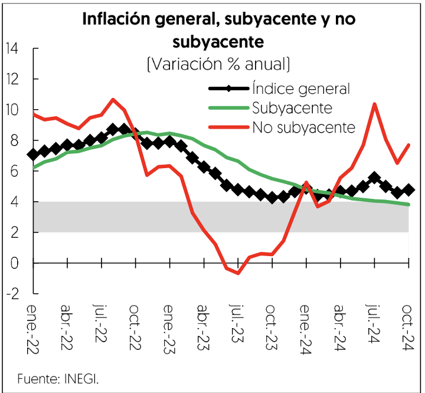
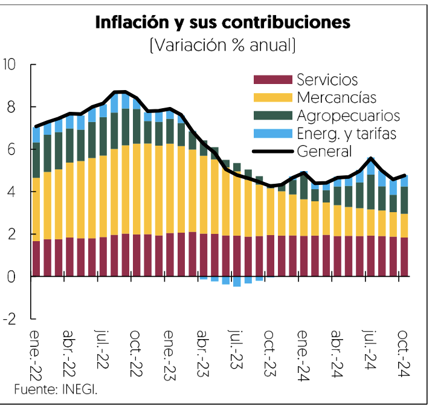

[⬅️ Anterior: 15](./15.md)[➡️ Siguiente: 17](./17.md)

# Página 16

La cuenta financiera registro una entrada neta de recursos por 20 mil 746 millones de ddlares, impulsada por la
inversion directa, la inversion de cartera —particularmente en titulos de deuda emitidos por la banca comercial

y el gobierno— y otras inversiones. Sin embargo, se observ6 una salida de recursos en el rubro de derivados
financieros.

Los flujos de IED hacia México durante el primer semestre de 2024 registraron una entrada de 31 mil 96 millones
de ddlares, el mayor monto desde que se tiene registro, con datos preliminares. Esta cifra se sustento en
reinversiones por 30 mil 288 millones de ddlares, lo que refrendd la confianza de los inversionistas extranjeros
en México para mantener y ampliar sus negocios en el pais. Por sectores, destacaron cifras significativas en la

industria manufacturera, las mas altas desde 2013 con cifras preliminares, y en los servicios financieros y de
seguros.

Inflacion

Entre enero y octubre, la inflaci6n general se situd en promedio en 4.8% anual, con el componente subyacente
en 4.2% anual y el no subyacente en 6.5% anual. En particular, la inflacin subyacente continud con su tendencia
a la baja, de manera que en octubre se ubicd en 3.8%, situacidn no vista desde finales de 2020. Lo anterior fue
explicado por la rapida desaceleracidn de los precios de las mercancias, particularmente las no alimenticias,
como muebles y ropa para el hogar, de manera que en el afio su indice promedié una inflacién de 2.2% anual,
3.8 pp por debajo del mismo periodo de 2023. La inflacién de los servicios también disminuyd, aunque a menor
ritmo, en 0.2 pp respecto a 2023 debido a la reduccidn de los precios en el componente de otros servicios en

genéricos como loncherias, fondas, torterias y taquerias y, restaurantes. Sin embargo, la presién en este rubro
se debid al servicio de telefonia mdvil y el transporte aéreo.

Durante 2024, el sistema financiero mexicano se mantuvo relativamente estable, con episodios de volatilidad,
especialmente en el mercado cambiario. Al 31 de octubre, el tipo de cambio se ubicd en 20.04 pesos por délar,
con una depreciacion de 15.3% en el afio, mientras que la volatilidad implicita del peso a un mes aumentd 12.7
pp respecto al cierre del afo anterior, debido a la incertidumbre en la evolucion de la politica monetaria de la
FED, las elecciones presidenciales en EE.UU., asi como por la liquidacién de posiciones de carry trade
financiadas en yenes. Por otra parte, persistieron factores idiosincraticos a nivel local.

[⬅️ Anterior: 15](./15.md)[➡️ Siguiente: 17](./17.md)