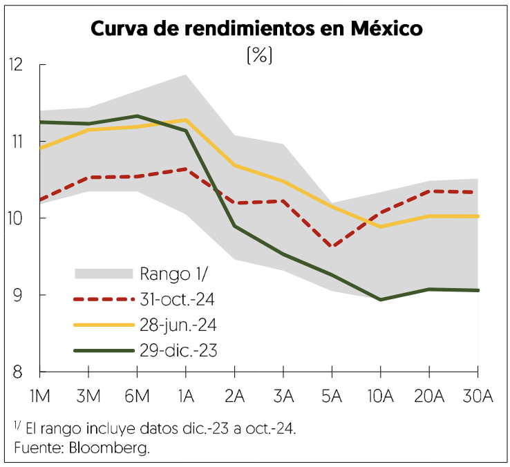
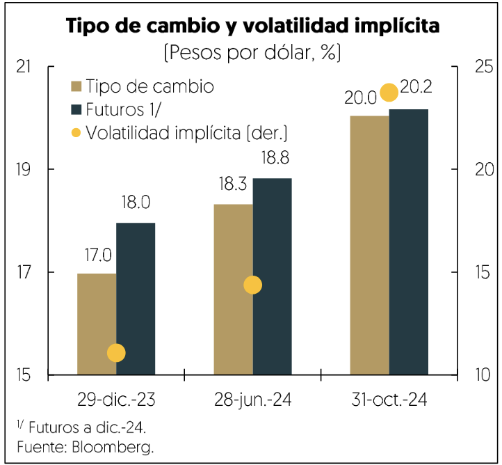

[⬅️ Anterior: 16](./16.md)[➡️ Siguiente: 18](./18.md)

# Página 17

El Banco de México redujo la tasa de referencia cuatro veces en el afio, en 25 pb en cada reunién hasta situarse
en 10.25%, derivado de la disminucién de las presiones inflacionarias y un crecimiento econdmico moderado.
Las expectativas de inflacidn a doce meses se mantuvieron ancladas, situandose en 3.8% en octubre, 28 pb
menos que al cierre de 2023.

La curva de rendimientos en pesos mostrd disminuciones generalizadas, destacando los nodos de corto plazo
debido a los recortes en la tasa de referencia y expectativas de futuros ajustes. Por su parte, en el acumulado
al 31 de octubre de 2024, el mercado accionario disminuy6 11.7%, con el Indice de Precios y Cotizaciones [IPC]

ubicandose en 50,661 unidades. Disminuyeron los rubros del sector financiero [-24.1%], consumo discrecional
(- 17.3%], consumo frecuente [- 12.7%] e industriales (- 9.7%], mientras que materiales liderd el crecimiento con
un aumento de 12.5%.

Al cierre de septiembre de 2024, el crédito vigente al sector privado no financiero de la banca comercial crecid
5.9% en términos reales, ajustado por estacionalidad. El crédito al consumo aumento 10.2%, impulsado por
arjetas de crédito y créditos de némina, mientras que el crédito a la vivienda subid 2.4%. El financiamiento a
empresas crecié 5.7%, con aportes de los sectores minerfa, comercio e industria manufacturera. El indice de
capitalizacién [ICAP] de la banca comercial en agosto fue de 19.4%, superando el minimo regulatorio de Basilea
II [10.5%], mientras que en septiembre tasa de morosidad ajustado por quitas y castigos se ubicd en 4.3%, 19
pb por encima de diciembre del afo previo

2.2.2 Perspectivas macroeconomicas para 2024

En lo que resta del afo, el mercado interno seguira contribuyendo al crecimiento de la actividad econdémica.
Por un lado, se espera que el consumo continuaraé aumentando debido a que cuenta con bases sodlidas. Por
ejemplo, de enero a octubre, la confianza del consumidor alcanz6 el mayor nivel desde 2001, lo cual se explica
por el buen desempefio de la mayoria de sus componentes. Tal es el caso del indicador de la situacién
econdmica actual y esperada del hogar, asi como la posibilidad de compra futura de bienes duraderos. Aunado
a lo anterior, el crédito al consumidor por parte de la banca comercial, que suele ser un indicador adelantado
de la actividad econdmica, continua con un buen dinamismo.

Asimismo, los indicadores del mercado laboral siguen mostrando un buen desempefo, aunque la creacién de
empleos se ha moderado. De enero a septiembre, la masa salarial real crecid 6.8% anual, impulsada por el

[⬅️ Anterior: 16](./16.md)[➡️ Siguiente: 18](./18.md)