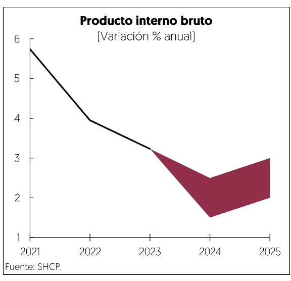

[⬅️ Anterior: 26](./26.md)[➡️ Siguiente: 28](./28.md)

# Página 27

El sector externo también contribuird al crecimiento econdmico ya que se prevé un desempefio positivo de la
produccidn industrial en EE.UU., la cual ha sido impulsada por el incremento en el gasto en construccién del
sector manufacturero, que ha presentado un aumento real 126% desde enero de 2021 hasta septiembre de
2024. Este resultado se debid a los estimulos fiscales de la Ley de Reduccién de la Inflacidn (IRA) y la Ley de
Creacion de Incentivos Utiles para Producir Semiconductores (CHIPS], que han incentivado el aumento en la
capacidad instalada en las industrias de electrénicos, equipo eléctrico, computacién y fabricacién de equipos
de transporte, sectores clave para la demanda de insumos mexicanos, en un contexto de relocalizacién de
empresas.

Ademas, se prevé que los estados con fuertes vinculos comerciales con México, como Texas y Michigan,
mantendran un ritmo de crecimiento favorable, asi como en aquellos estados en los que el pais ha diversificado
su presencia, como Georgia, Tennessee eé Illinois, donde México aumento su participacidn en 2.9%, en
promedio, entre 2018 y 2024. Asimismo, se espera que el entorno post-electoral en EE.UU. brinde mayor
confianza al sector empresarial, como lo reflejaron los ultimos indicadores adelantacdos de octubre pasado. La
relajacion de las condiciones financieras restrictivas, producto del ciclo de baja de tasas por parte de la FED y
el Banco de México, junto con la reduccidn de la inflacién y la normalizacién del exceso de ahorro de los
hogares, estimulardn el incremento de la inversién y el consumo privado tanto en México como en EE.UU.

Finalmente, la reconstruccién de algunas ciudades de la costa este de EE.UU. por los huracanes a finales de
2024, dara un impulso a la actividad econdédmica de México a través del aumento al empleo de los
connacionales en el sector construccién, lo que incrementara el flujo de remesas a México, y ademas se
demandarén mayores insumos para la edificacion, los cuales de enero a septiembre de 2024 representaron
10.4% de las exportaciones manufactureras totales de México a EE.UU.

Estimacién de las principales variables macroeconémicas*

Como resultado de lo descrito anteriormente, se estima que en 2025 el crecimiento de la economia mexicana
se ubique en un rango de 2.0 a 3.0% real anual. Dicho prondstico se ubica en linea respecto a lo publicado en
el Paquete Econdmico 2024 y representa el inicio de una trayectoria de crecimiento incluyente durante la
presente administracion, capaz de permear en el bienestar de la poblacion.

? Para mayor detalle consultar el anexo 11.5

[⬅️ Anterior: 26](./26.md)[➡️ Siguiente: 28](./28.md)