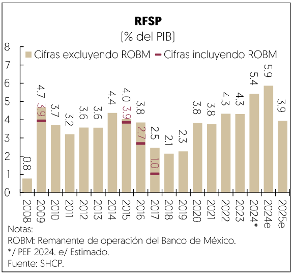
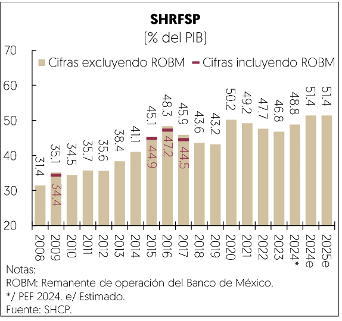
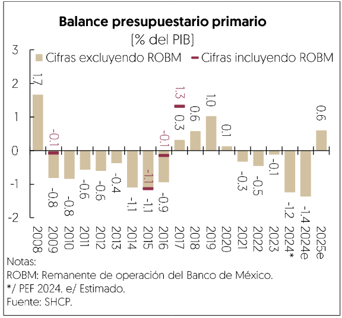
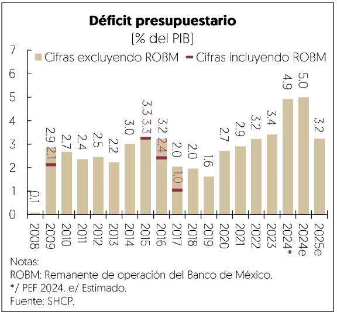

[⬅️ Anterior: 30](./30.md)[➡️ Siguiente: 32](./32.md)

# Página 31

posicién fiscal de México permanezca en una trayectoria estable en el contexto del inicio de la actual
administracion.

Metas para las empresas publicas del Estado

El proyecto de presupuesto 2025 propuesto para Pemex presenta un superavit financiero de 249 mil millones
de pesos y un techo de gasto de servicios personales de 114 mil millones de pesos. Este resultado incluye una
transferencia del Gobierno Federal por 136 mil millones de pesos para el pago del total de las amortizaciones
de deuda de mercado y créditos bancarios adquiridos por la empresa. La aportacién del Gobierno Federal se
encuentra sujeta al compromiso de Pemex de mejorar su balance en la misma cantidad —resultando en un
efecto neutral del déficit del Sector Publico— y a que, en lo posible, el saldo de la deuda publica de Pemex
refleje una reduccidn respecto al saldo del afio anterior. Este apoyo se complementara con otras medidas para
mejorar la situacion financiera de la empresa, entre las cuales destaca el Derecho Petrolero para el Bienestar,
en apoyo a los objetivos de produccién planteados en la Estrategia Nacional del Sector de Hidrocarburos y
Gas Natural y la disminucién de la deuda.

[⬅️ Anterior: 30](./30.md)[➡️ Siguiente: 32](./32.md)