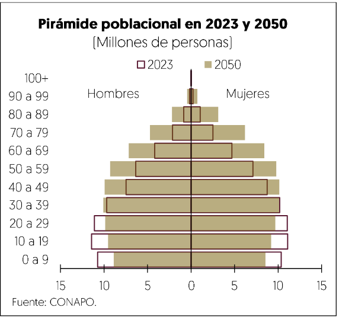

[⬅️ Anterior: 58](./58.md)[➡️ Siguiente: 60](./60.md)

# Página 59

Con respecto a las pensiones contributivas, el sistema actual garantiza la viabilidad de las finanzas publicas en
el largo plazo; no obstante, en el mediano plazo persisten presiones ocasionadas por el pago de pensiones
en curso del antiguo sistema de reparto.

El pasivo pensionario® ha mantenido su comportamiento conforme a las proyecciones realizadas, derivado de
las reformas en la materia. En 2023, el ISSSTE concentrd el 53.7% del activo pensionario total, el IMSS 27.2% y
Pemex el 11.7%. Por su parte, los activos netos de las AFORE mostraron incrementos importantes anuales que
alcanzaron en agosto de 2024 un nivel de 6 billones 579 mil millones de pesos, equivalente al 19% de PIB.

## Pasivo pensionario  

| **Institución**      | **Miles de millones de pesos de 2023** | **% del PIB de 2023** |
|-----------------------|---------------------------------------|-----------------------|
| IMSS-RJP 1/          | 3,197.4                              | 9.6                   |
| ISSSTE 2/            | 6,326.9                              | 19.0                  |
| CFE 3/               | 611.7                                | 1.8                   |
| Pemex 4/             | 1,372.5                              | 4.1                   |
| Otros EAPF 5 y 6     | 265.0                                | 0.8                   |
| **Total**            | **11,773.5**                         | **35.4**              |

**Notas**:  
1/ Dato 2023, Informe al Ejecutivo Federal y al Congreso de la Unión sobre la Situación Financiera y los Riesgos del IMSS 2023-2024. Incluye al IMSS como patrón.  
2/ Dato 2022. Resultados de Valuación Actuarial ISSSTE, actualizados con inflación.  
3/ Dato 2023. Estados Financieros CFE.  
4/ Dato 2023. Estados Financieros Pemex.  
5/ Dato 2023. Resultados de Valuación Actuarial de Banca de Desarrollo, Órganos Desconcentrados.  
6/ Dato 2022, Resultados de Valuación Actuarial de INDEP y Entidades Liquidadas; datos consolidados de SHCP.  

**Fuente**: Elaboración SHCP con información de las dependencias.

5 La informacion del pasivo pensionario esta basada en lo reportado dentro de las valuaciones actuariales y los estados financieros de las entidades [IMSS-RJP, ISSSTE, CFE, Pemex y otras entidades de la Administracién Publica Federal] al cierre de cada ejercicio. La  informacion de ISSSTE para 2023, corresponde al cierre 2022 ajustado con inflacién, debido a que atin no se aprueba y publica la valuacién actuarial.

[⬅️ Anterior: 58](./58.md)[➡️ Siguiente: 60](./60.md)